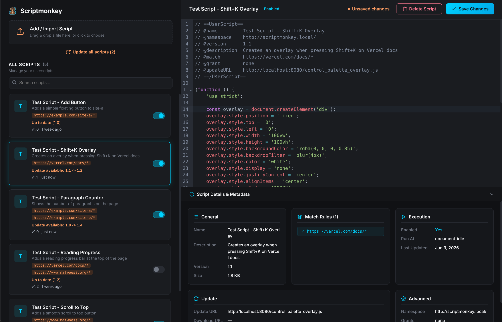

# Scriptmonkey

Lightweight Manifest V3 Chrome extension for managing user scripts locally in your browser.

## Overview

Scriptmonkey is a minimal, free, open-source and local Tampermonkey alternative built specifically for Google Chrome's Manifest V3 `userScripts` API. It features a management dashboard with a code editor, metadata inspection, and a quick-action toolbar popup.

📖 **Full Documentation**: Visit the [Website](https://matwoess.github.io/scriptmonkey/) or read the [Docs](https://matwoess.github.io/scriptmonkey/docs/intro).

## Quick Start

1. Install Scriptmonkey from the [Chrome Web Store](https://chromewebstore.google.com/detail/scriptmonkey-beta/afmgkdanppbobipehgpfcmhpgeoejcpn).
2. Open `chrome://extensions` in Chrome and enable **Allow User Scripts** for Scriptmonkey.
3. Open the Popup or Dashboard to create, import, or manage your user scripts.

## What Scriptmonkey Does & Does Not Do (Yet)

### What It Does

- **Manifest V3 Native Execution**: Uses Chrome's `chrome.userScripts` API to register and run scripts securely in the page's `MAIN` world context.
- **Local Dashboard & Code Editor**: Integrated CodeMirror 6 JavaScript editor with syntax highlighting, live error validation, and `Ctrl+S` quick save.
- **Toolbar Controls & Badge**: View active scripts per tab, toggle script states, check active count badge, and delete scripts from the extension popup.
- **URL Pattern Matching**: Supports `@match`, `@include` (wildcards, regex, `.tld` replacement), and `@exclude` rules.
- **Version Update Checks**: Fetches remote `@updateURL` / `@downloadURL` endpoints and compares versions to provide per-script or batch updates.
- **Complete Privacy**: All scripts and settings are saved locally in `chrome.storage.local`.

### What It Does Not Do Yet

- **`GM_*` Privileged APIs**: `GM_setValue`, `GM_getValue`, `GM_xmlhttpRequest`, `GM_addStyle`, etc., are **not** implemented. Scripts run directly in the `MAIN` page context without special background privileges.
- **External Dependencies**: `@require` (external script libraries) and `@resource` (external asset injection) are currently unsupported.
- **Background Cron Updates**: Automatic scheduled background update checks are not performed; update checks are manual.
- **Cross-Device Sync**: Scripts do not sync via Chrome Sync or cloud services.

### Supported Metadata Keys

Scriptmonkey parses standard `==UserScript==` header blocks.

For details on supported metadata keys and how they are handled, see [Metadata Support](https://matwoess.github.io/scriptmonkey/docs/metadata-support).

## Documentation Links

- 📚 [Documentation Overview](https://matwoess.github.io/scriptmonkey/docs/intro)
- ⚙️ [Features & Metadata Support](https://matwoess.github.io/scriptmonkey/docs/metadata-support)
- 🛠️ [Development & Building Guide](https://matwoess.github.io/scriptmonkey/docs/development)
