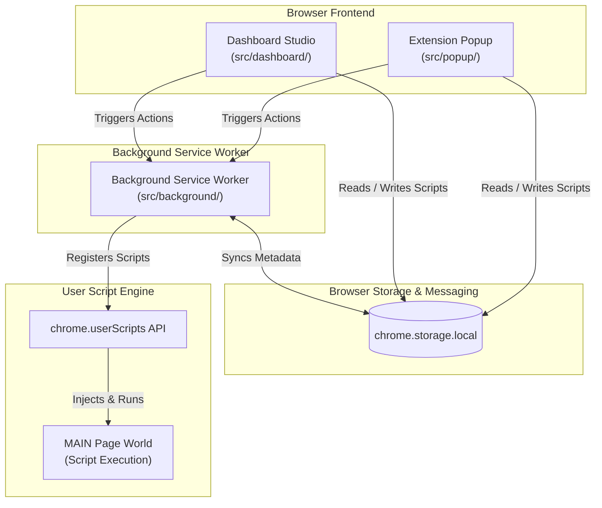

# Technical Architecture

**Scriptmonkey** relies on native browser APIs to execute user scripts locally without external server dependencies.

## Architecture Overview

## Core Components

### 1. Frontend User Interfaces

- **Popup UI (`src/popup/`)**: A React and TypeScript interface accessible from the browser toolbar. Provides quick script toggles, domain-matched script counts, update checks, and dashboard navigation.
- **Dashboard Studio (`src/dashboard/`)**: A full-screen IDE for managing and authoring scripts. Includes a CodeMirror 6 editor with JavaScript syntax validation, metadata sidebar previews, drag-and-drop file imports, and unsaved change guards.
- **Shared Styling**: Shared design tokens and CSS variables in `src/theme.css` ensure visual consistency across all extension surfaces.

### 2. Background Service Worker (`src/background/`)

- Runs as a Manifest V3 background service worker (`src/background/index.ts`).
- Manages state persistence, extension events, UI communication, and script metadata extraction.
- Checks remote `@updateURL` / `@downloadURL` endpoints for version updates when requested by the user.

### 3. Execution Engine (`chrome.userScripts`)

- Leverages Chrome's native `chrome.userScripts` API to register and run scripts.
- Executes user scripts directly in the document's `MAIN` execution world.

## Data Flow & Storage

- **Local Persistence**: Script code, configurations, and parsed metadata reside in `chrome.storage.local`.
- **Privacy First**: No telemetry, analytics, or script contents are transmitted to external servers.
